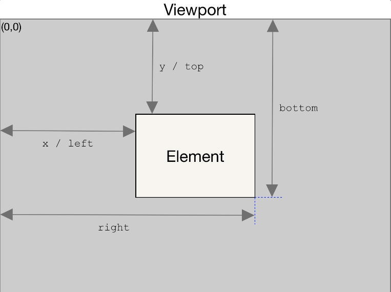

## 滑倒的指定位置

#### 滑到元素位置

```jsx
// scroll到元素位置
export const scrollToElement = (el: HTMLElement | null) => {
  el?.scrollIntoView({
    behavior: 'smooth'
  })
}
```

#### 滑动多少距离

```js
// scroll指定距离
export const scrollToPosition = (distance: number) => {
  window.scrollTo({
    top: distance,
    behavior: 'smooth'
  })
}
```

#### 滑到顶部

```js
// scroll到页面顶部
export const scrollToTop = () => {
  window.scrollTo(0, 0)
}
```

## 获取元素的位置

```jsx
export const getElementPosition = (
  el: HTMLElement | null,
  position: 'top' | 'bottom' | 'right' | 'left'
) => {
  return el?.getBoundingClientRect()[position]
}
```


