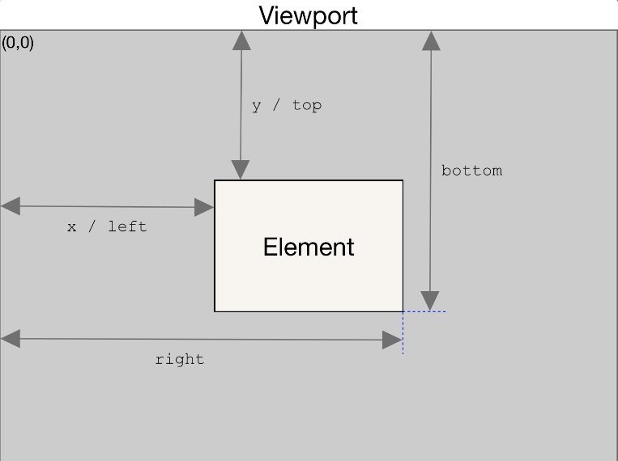

## 不常见属性

```css
颜色反转：filter: invert(1);
高斯模糊：backdrop-filter: blur(10px);
img禁止元素拖动：-webkit-user-drag: none;
html禁止文本选中：user-select: none;s
亮度：filter: brightness(0.2);
整个滚动条：::-webkit-scrollbar
滚动条轨道：::-webkit-scrollbar-track
滚动条上的滚动滑块：::-webkit-scrollbar-thumb
裁剪：clip-path:circle(40%);
遮罩: mask
除了最后一个: :not(:last-child)
元素上有两个类如active,可以写成 .item.active
```

## 文字溢出

```css
/* 多行 */
overflow: hidden;            // 溢出隐藏
text-overflow: ellipsis;     // 溢出用省略号显示
display:-webkit-box;         // 作为弹性伸缩盒子模型显示。
-webkit-box-orient:vertical; // 设置伸缩盒子的子元素排列方式：从上到下垂直排列
-webkit-line-clamp:3;        // 显示的行数
```

## 背景图片

**背景图片铺满盒子：**

```css
background-image: url('xxx.png');
background-position: 50%;/*或者center*/
background-repeat: no-repeat;
background-size: cover;
```

**类似朋友圈图片展示功能：**

```css
.fa {
    background-color: skyblue;
    width: fit-content;
}

.son {
    height: 100%;
    width: 100%;
    object-fit: cover;
    max-height: 400px;
    max-width: 400px;
    min-height: 200px;
    min-width: 200px;
}
```

## box-shadow

```jsx
/_ x 偏移量 | y 偏移量 | 阴影模糊半径 | 阴影扩散半径 | 阴影颜色 _/
box-shadow: 2px 2px 2px 1px rgba(0, 0, 0, 0.2);

box-shadow有以下属性：

inset：用于指定阴影是否为内阴影。
h-offset：用于指定水平偏移量。
v-offset：用于指定垂直偏移量。
blur-radius：用于指定模糊半径。
spread-radius：用于指定阴影的扩展半径。
color：用于指定阴影的颜色。
可以使用逗号分隔多个阴影，每个阴影之间用空格分隔。例如：

box-shadow: 2px 2px 10px #888888, -2px -2px 10px #888888;
```

## animation

```css
animation-name：指定要使用的@keyframes规则的名称。
animation-duration：指定动画的持续时间。
animation-timing-function：指定动画的缓动函数，用于控制动画的速度变化。
animation-delay：指定动画开始执行的延迟时间。
animation-iteration-count：指定动画应该重复执行的次数。
animation-direction：指定动画循环时的方向。
animation-fill-mode：指定动画在执行前和执行后的样式状态。
animation-play-state：指定动画的播放状态，用于控制动画的暂停和播放。
以下是一个示例animation属性的代码：

div {
  animation-name: slide-in;
  animation-duration: 1s;
  animation-timing-function: ease-out;
  animation-delay: 0s;//开始执行
  animation-iteration-count: infinite;//重复执行无数次
  animation-direction: alternate;//交替执行
  animation-fill-mode: forwards;//保留最后一帧的状态
  animation-play-state: running;//正在播放
}
```

## flex

flex-grow 默认值为 0 不可以拉伸，flex-shrink 默认值为 1 可以收缩，flex-basis 默认值是 auto

也就是 flex: initial === flex 0 1 auto，这个默认值让项目较少时不会去填充满剩余空间，项目较多时文字能换行，还有一个常见的是`flex: 1 === flex:1 1 0%`

flex 容器有剩余空间时尺寸不会增长（flex-grow:0），flex 容器尺寸不足时尺寸会收缩变小（flex-shrink:1），尺寸自适应于内容（flex-basis:auto）（行为类似 fit-content）。如果 flex-basis:0%，则为忽略自身宽度。

```js
console.log(getComputedStyle(document.body).flexGrow) //flex-grow默认值为0
console.log(getComputedStyle(document.body).flexShrink) //flex-shrink默认值为1
console.log(getComputedStyle(document.body).flexBasis) //flex-basis默认值是auto
```

flex 使元素被挤压


解决方案

```css
/* 在按钮上加 */
.btn {
  /* ...之前的代码 */
  flex-shrink: 0;
  /* 或者 */
  flex: none;
}
/* 或者在内容上加 */
.content {
  flex: 1;
}
```

flex 是文字溢出省略号显示失效


解决方案

去掉 flex，如果高度不对，可以自己写行高

## getBoundingClientRect



## 元素位置


