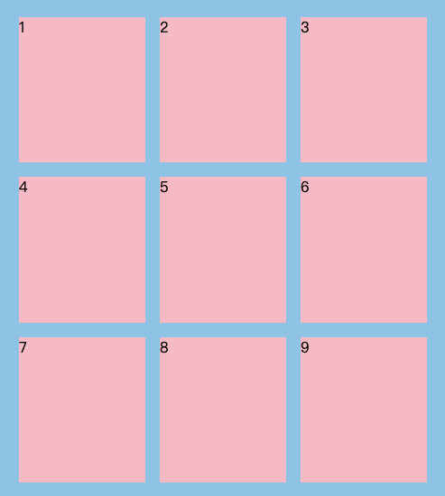
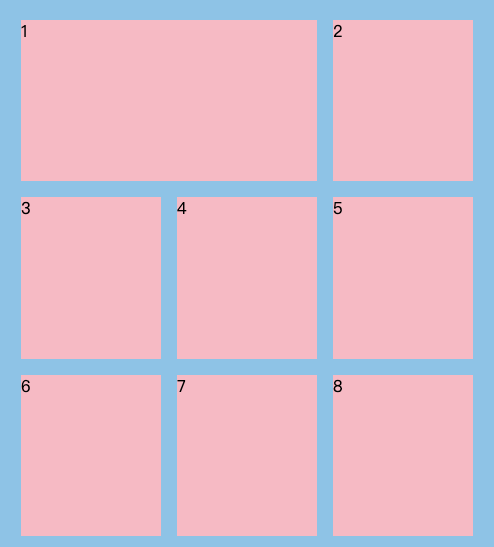
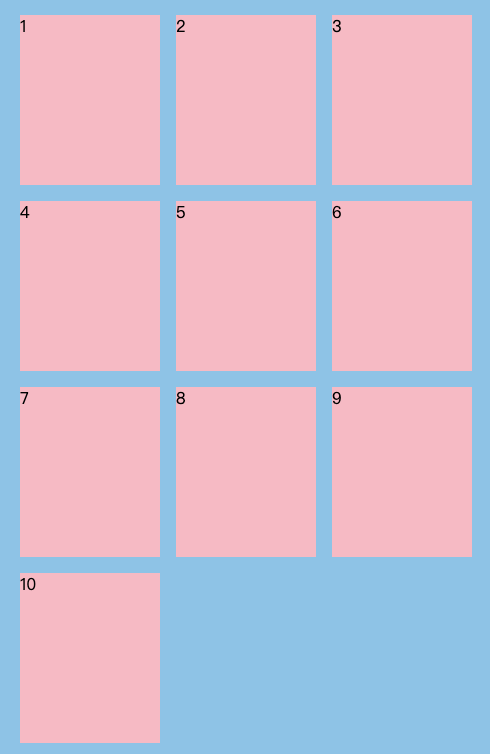
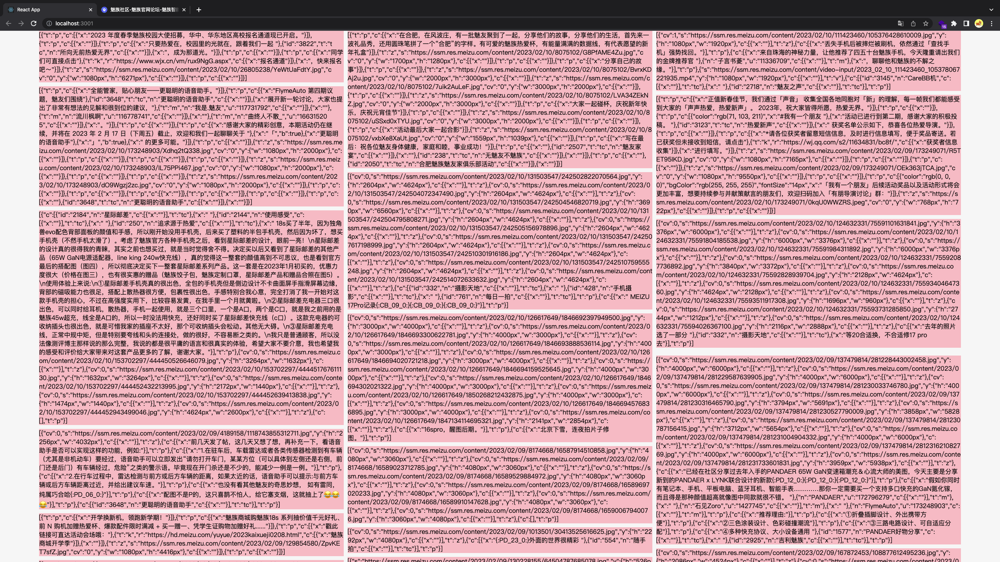

#### JSX DEMO

```js
//jsx
const arr = [1, 2, 3, 4, 5, 6, 7, 8, 9]
return (
  <div className={styles.fa}>
    {arr.map((item, index) => {
      return <div className={styles.son}>{item}</div>
    })}
  </div>
)
```

## 基础多行多列布局




#### 方案一

只需要知道容器长/宽/间隙/排多少列排多少行，不需要项目的大小（推荐，更直观）

```css
.fa {
  background-color: skyblue;
  padding: 24px;
  display: grid;
  /* 只需要知道长/宽/间隙/排多少列排多少行，不需要项目的大小 */
  width: 500px;
  height: 600px;
  gap: 16px;
  grid-template-columns: repeat(3, 1fr); /*均分500px*/
  grid-template-rows: repeat(3, 1fr); /*均分600px*/
}
.son {
  background-color: pink;
}
```

#### 方案二

不需要知道容器长/宽，需要知道间隙，项目的大小

```css
.fa {
  background-color: skyblue;
  padding: 24px;
  display: grid;
  /* 不需要知道长/宽，需要知道间隙，项目的大小 */
  grid-template-columns: repeat(3, 140px);
  grid-template-rows: repeat(3, 170px);
  gap: 16px;
  width: fit-content;
}
.son {
  background-color: pink;
}
```

## 一个项目占两个单元格




#### 方案一

```css
/* 在上面的基础上加grid-column,同理占两行使用grid-row:1/3 */
.son:first-of-type {
  grid-column: 1/3;
}
```

## 不确定项目数量布局

如果 UI 图是屏幕尺寸缩小间隙和项目大小不变的时候，这样最好处理（最理想的情况）




#### 方案一

```css
.fa {
  background-color: skyblue;
  padding: 24px;
  display: grid;
  /* 不需要知道长/宽，需要知道间隙，项目的大小 */
  grid-template-columns: repeat(3, 140px); /*均分500px*/
  grid-auto-rows: 170px;
  /* 不需要使用grid-template-rows: repeat(auto-fill, 170px);，使用了上面的隐式网格就行了  */
  gap: 16px;
  /*因为跟宽度无关，除了下面的fit-content,还可以写死width，然后做均分*/
  width: fit-content;
}
.son {
  background-color: pink;
}
```

## 响应式布局

不确定容器宽高

> 间隙固定会明显觉得网页更美观
>
> 错误方案，如果项目的宽高固定，间隙也固定，这种情况不能实现响应式

#### 方案一

如果项目的宽高不固定，间隙固定

会有一个问题，因为响应式的网站，设计的时候，可能会设计媒体查询，当屏幕尺寸变小，可能 gap/minmax 的值发生变化，写了媒体查询会出现一个问题，会在某些情况下，比如先出现四个子项目，但因为 minmax 的值变化缩小的时候反而会出现 5 个子项目，这种情况，如果想要它顺序从 5 到 4，只能再多写媒体查询去兼容，但仔细想想，从 4 到 5 也是正常现象，我是多写几套媒体查询解决的，虽然很笨，但也没有办法

```css
.fa {
  background-color: skyblue;
  padding: 24px;
  display: grid;
  /* 不需要知道长/宽，需要知道间隙，项目的大小 */
  grid-template-columns: repeat(auto-fill, minmax(140px, 1fr)); /**/
  grid-auto-rows: 170px;
  gap: 16px;
  width: 100%;
  box-sizing: border-box;
}
.son {
  background-color: pink;
}
```

但是上面的方案有个问题，上面的高度写死了 170px，如果子项目有宽高比例，该怎么去计算

- 解决 1: `aspect-ratio`可以支持宽高比，但是兼容性不太好，safari 不支持
- 解决 2: 通过`calc`，往往是**calc((视宽 100vw - 2 内边距 - n 间隙)/项数) \*宽高比**

总结 grid 响应式不太完善，会设计挺多小计算，会写比较多的媒体查询，暂未找到优雅的解决方式～

## 响应式瀑布流布局

www.meizu.cn

瀑布流有很多种，因为标准文档流是从上到下排列的，而瀑布流这种错乱横排的方式就显得比较麻烦，还需要 js 去处理，而响应式的瀑布流更显麻烦，如果里面的元素宽高都不固定，那就是遇到了麻烦中的麻烦

- 竖着排列，一列排完排下一列，这种 flex 和 css 就可以实现，但是顺序是错乱的，瀑布流一般是横着排列
- 横着排列，只有图片，所有宽度相同，知道高度，这种情况在很多图片网站可以看到，是动态计算出 transform 要位移的值实现的
- 如果我们不知道宽高怎么办，支持比上面一种情况更复杂的响应式怎么办，这种最麻烦的情况，可以通过 grid 和一点 js 实现，`grid-row:auto span / 数字`这个是关键，也就是前面讲到的一个项目占两个单元格，瀑布流就是多占用单元格

#### 方案一

```jsx
import { useEffect } from 'react'
import { data } from './data'
import styles from './index.module.css'
export default function App() {
  const elements = document.querySelectorAll('#fa li') // 为了监听下拉刷新
  useEffect(() => {
    const handle = () => {
      // 拿到动态的节点
      const faId = document.getElementById('fa')
      faId?.childNodes?.forEach((item) => {
        const clientHeight = item?.clientHeight || 0
        const count = parseInt(clientHeight)
        const result = `auto / span ${count}`
        item.style.gridRow = result
      })
    }
    handle()
    window.addEventListener('resize', handle)
    return () => window.removeEventListener('resize', handle)
  }, [elements])
  return (
    <ul className={styles.fa} id="fa">
      {data?.map((item, index) => {
        return (
          <li key={index} className={styles.son}>
            <div className={styles.inner}>{item.detail.content}</div>
          </li>
        )
      })}
    </ul>
  )
}
```

```css
.fa {
  padding: 0 100px;
  margin: 0 auto;
  display: grid;
  grid-template-columns: repeat(auto-fill, minmax(36.8rem, 1fr));
  grid-auto-rows: 1px;
  column-gap: 10px;
}
.son {
  word-break: break-all;
  height: fit-content;
  padding-bottom: 10px;
}
.inner {
  background-color: pink;
}
```



#### 细节

- 如果有图片懒加载，则可能使瀑布流出错，可以自己计算图片高度，也就是手写一个 object-fit：contain 或者 cover 属性
- 如果要动态让 li 的高度可以变化，可以给计算增加一个依赖项，比如 count(我是存 mobx 里了)，触发某件事，让 count+1，每次 count 变化则重新计算瀑布流
- grid-row:auto span / 数字; 的值必须是整数
- grid-auto-rows: 1px; 这个属性 firfox 和 qq 浏览器渲染有问题（edge，chrome，safari 没问题），叠瀑布流跌了几十个元素后开始重叠元素

## 展望

有看到未来 grid 设置一个属性直接支持瀑布流布局，希望未来能支持
