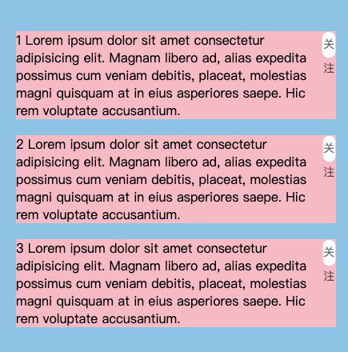

## flex基础知识

#### flex一些属性的默认值

flex-grow默认值为0不可以拉伸，flex-shrink默认值为1可以收缩，flex-basis默认值是auto

也就是flex: initial === flex 0 1 auto，这个默认值让项目较少时不会去填充满剩余空间，项目较多时文字能换行

> flex容器有剩余空间时尺寸不会增长（flex-grow:0），flex容器尺寸不足时尺寸会收缩变小（flex-shrink:1），尺寸自适应于内容（flex-basis:auto）（行为类似fit-content）。

```js
console.log(getComputedStyle(document.body).flexGrow);//flex-grow默认值为0
console.log(getComputedStyle(document.body).flexShrink);//flex-shrink默认值为1
console.log(getComputedStyle(document.body).flexBasis);//flex-basis默认值是auto
```

#### flex缩写属性的值

flex长语法比较难记，所以开发的时候尽量用缩写，记住下面两个用得稍多一点的缩写就行了

`flex: 1 === flex:1 1 0%`

`flex:none === flex:1 1 0%`

## flex 使元素被挤压

下面的代码使关注按钮被挤压了，因为flex-shrink默认值 为 0，元素可以被缩小

```jsx
const arr = []
<div className={styles.fa}>
  {arr.map((item, index) => {
    return (
      <div className={styles.son} key={index}>
        <div className={styles.content}>
          {item} Lorem ipsum dolor sit amet consectetur adipisicing elit. Magnam
          libero ad, alias expedita possimus cum veniam debitis, placeat,
          molestias magni quisquam at in eius asperiores saepe. Hic rem
          voluptate accusantium.
        </div>
        <div className={styles.btn}>关注</div>
      </div>
    )
  })}
</div>
```

```css
.fa {
  background-color: skyblue;
  padding: 24px;
  width: 400px;
  margin-left: 200px;
  margin-top: 200px;
}
.son {
  background-color: pink;
  margin: 20px 0;
  display: flex;
  justify-content: space-between;
}
.btn {
  width: 66px;
  height: 32px;
  line-height: 30px;
  background: #fff;
  text-align: center;
  border: 1px solid rgba(0, 0, 0, 0.15);
}
```



#### 方案一

```css
.btn {
  /* ...之前的代码 */
  flex-shrink: 0;
  /* 或者 */
  flex:none
}
```

#### 方案二

```css
.content{
  flex: 1;
}
```

## flex 使溢出省略号失效

## sticky 不生效
